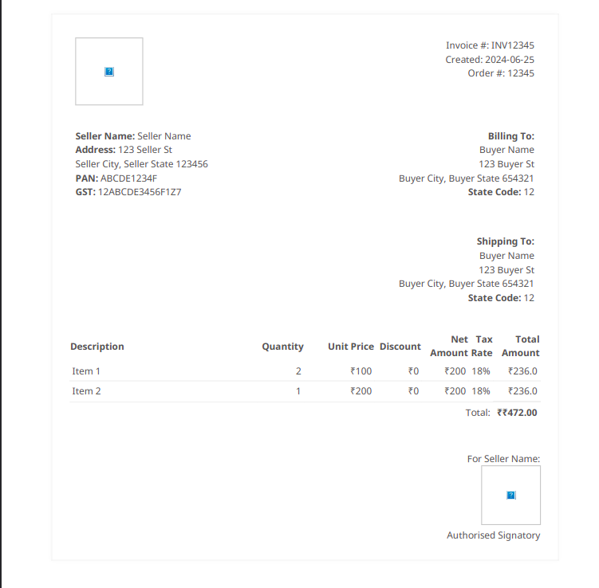

To add an image of the invoice to your README file, you can follow these steps:

1. **Prepare the Image:**
   - Ensure you have an image of the generated invoice (`invoice.pdf`) that you want to showcase.

2. **Store the Image:**
   - Place the image (`invoice.png`, for example) in your project directory or a designated folder.

3. **Update README with Image:**
   - Use Markdown syntax to embed the image in your README file.

Here's how you can modify your README to include the invoice image:

```markdown
# Invoice Generator

This project automates the creation of PDF invoices from provided data using Python, Jinja2 templating, and pdfkit.

## Features

- **Professional Invoices:** Generates professional-looking PDF invoices.
- **Tax Calculation:** Supports both CGST/SGST and IGST tax calculations based on the place of supply and delivery.
- **Dynamic Totals:** Dynamically calculates totals, tax amounts, and net amounts for each item.
- **Detailed Information:** Includes detailed seller, billing, and shipping information.
- **Customizable:** Easily customizable with your company logo and authorized signature.

## Prerequisites

Ensure you have the following installed:

- Python 3.x
- pdfkit
- Jinja2
- wkhtmltopdf (required by pdfkit for PDF rendering)

### Installing Dependencies

1. Clone this repository:
   ```bash
   git clone https://github.com/yourusername/invoice-generator.git
   cd invoice-generator
   ```

2. Install Python dependencies:
   ```bash
   pip install -r requirements.txt
   ```

3. Install wkhtmltopdf:
   - **Ubuntu/Debian:**
     ```bash
     sudo apt-get install wkhtmltopdf
     ```
   - **macOS:**
     ```bash
     brew install wkhtmltopdf
     ```
   - **Windows:** Download and install from [wkhtmltopdf website](https://wkhtmltopdf.org/downloads.html).

## Usage

1. **Prepare Your Data:**
   - Update `seller_details`, `billing_details`, `shipping_details`, `order_details`, `invoice_details`, and `items` dictionaries in `invoice_generator.py`.

2. **Customize Invoice Layout (Optional):**
   - Modify the HTML structure in `invoice_template.html` to adjust the invoice layout.

3. **Generate Invoice:**
   ```bash
   python invoice_generator.py
   ```

4. **View Invoice:**
   - The generated PDF invoice will be saved as `invoice.pdf` in the current directory.

## Preview of Generated Invoice



## Customization

- **Invoice Template:** Adjust `invoice_template.html` to change the layout, styling, or content of the invoice.
- **Data Formatting:** Modify `format_currency` and `amount_in_words` functions in `invoice_generator.py` as per your requirements.
- **Images:** Replace `logo.png` and `signature.png` placeholders with your actual logo and signature images.

## Contributing

Contributions are welcome! Please fork the repository and submit a Pull Request with your improvements.

## License

This project is licensed under the MIT License. See the LICENSE file for details.
```

### Explanation:

- **Preview of Generated Invoice Section:** Added a new section titled "Preview of Generated Invoice" where the image of the invoice (`invoice.png`) is displayed using Markdown image syntax (``).
- **Path to Image:** Replace `path/to/invoice.png` with the actual path where your invoice image (`invoice.png`) is located relative to your README file.

By following these steps, users can visually preview the generated invoice directly within your README, providing them with a quick glimpse of the output your invoice generator produces. Adjust the image path and filename as per your project's directory structure and naming conventions.